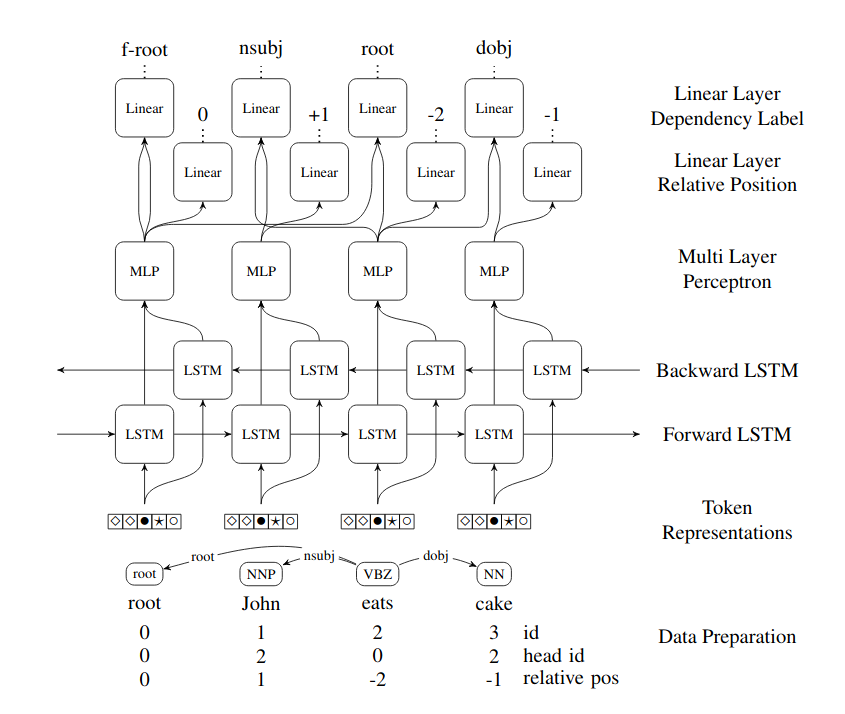

# Parsing as Tagging

## Table of Contents
1. [Highlights](#highlights)
2. [Environment set-up](#environment_setup)
3. [Data](#data)
4. [Architecture](#architecture)
5. [Hyperparameters](#hyperparameters)
6. [Run](#run)

<a name="highlights"></a>
### Highlights
Treat the dependency parsing problem as a tagging problem. For each token, the tag to be predicted is the relative position of the corresponding head. Using the current token and its predicted head, we then predict the label.

This simple architecture performs well. For example, we obtain <b>92.69%</b> UAS and <b>90.25%</b> LAS on English, <b>92.95%</b> UAS and <b>89.87%</b> LAS on French, and <b>88.44%</b> UAS and <b>83.44%</b> LAS on German, by only tuning on English.


Our trained models are available at [OSF PaT](https://osf.io/xpr27/), together with the data we used.

<a name="environment_setup"></a>
### Environment set-up
```
conda create -n pat python=3
conda activate pat
conda install pytorch=1.3.0 torchvision cudatoolkit=10.0 -c pytorch
pip install pytorch-pretrained-bert
pip install networkx
```

<a name="data"></a>
### Data
We used Universal Dependencies 2.2.

For each dataset, we filtered non-integer id and deleted the comments.

The exact data we used is available at [OSF PaT](https://osf.io/xpr27/)

<a name="architecture"></a>
### Architecture


For each word, we predict 
* relative position of the head
* label

We use a BiLSTM that operates over our token representation (BERT (without fine-tuning) + word Embedding + char-level embedding + part-of-speech embedding). The resulted hidden state is then passed into an MLP. The result is then used to predict the head. To predict the label, we concatenate the MLP outputs of the current token and its predicted head.


<a name="hyperparameters"></a>
### Hyperparameters

The parameters used for our 'un-tuned' version. This set of parameters were selected out of 100 possible configurations.

<details>
  <summary>Long table with the hyperparameters used for 'un-tuned' version</summary>

| Parameter                              | Value     |
|----------------------------------------|-----------|
| Early stopping                         | 3         |
| Batch size                             | 64        |
| CNN kernel size                        | 3         |
| CNN embedding size                     | 50        |
| CNN output size                        | 50        |
| Learning rate                          | 0.002     |
| &beta;<sub>1</sub>, &beta;<sub>2</sub> | 0.7, 0.99 |
| Dropout                                | 0.6       |
| Weight decay                           | 1e-5      |
| BiLSTM layers                          | 3         |
| BiLSTM hidden-size                     | 600       |
| BiLSTM dropout                         | 0.3       |
| MLP Hidden Layers                      | 500, 150  |
</details>

The parameters used for our 'tuned' version. For each language, we selected the best performing parameters from a search space of 12 configurations. Same search space was used for all languages.

<details>
  <summary>Long table with hyperparameters per language</summary>
  
|         | Learning rate | Dropout | MLP Hidden Layers |
|---------|---------------|---------|-------------------|
| ar      | 0.0025        | 0.50    | 400, 150          |
| bu      | 0.0025        | 0.50    | 400, 150          |
| ca      | 0.0025        | 0.50    | 400, 150          |
| cs      | 0.0020        | 0.50    | 500, 150          |
| de      | 0.0020        | 0.55    | 500, 150          |
| en      | 0.0020        | 0.60    | 500, 150          |
| en (SD) | 0.0020        | 0.55    | 500, 150          |
| es      | 0.0020        | 0.50    | 500, 150          |
| et      | 0.0020        | 0.50    | 500, 150          |
| fr      | 0.0020        | 0.60    | 500, 150          |
| it      | 0.0020        | 0.55    | 500, 150          |
| ja      | 0.0025        | 0.50    | 400, 150          |
| nl      | 0.0025        | 0.50    | 400, 150          |
| no      | 0.0020        | 0.55    | 500, 150          |
| ro      | 0.0025        | 0.50    | 400, 150          |
| ru      | 0.0020        | 0.50    | 500, 150          |
</details>

The parameters not appearing in the table are kept the same as in 'un-tuned' version

Random seeds used:

UD
```
1 2449 9959019
```
SD
```
1 2449 4973 3499854 9959019
```

<a name="run"></a>
### Run
In order to run, you have to create the environment, as described in [Environment set-up](#environment_setup).
The next step is cloning the repository:
```
git clone https://github.com/clulab/releases
cd releases/lrec2020-pat
```
We provide the data we used for English as an archive in ```data/UD_2.2```. To be able to use it, you must first unzip it:
```
mkdir data/UD_2.2/en
unzip data/UD_2.2/en.zip -d data/UD_2.2/en
```

Now everything is ready. You can train using the following command:
```
python train.py data/UD_2.2/en/en_ewt-ud-train.conllu data/UD_2.2/en/en_ewt-ud-dev.conllu --output data/UD_2.2/en/ --bert --random-seed 1 --learning-rate 0.0020 --beta1 0.7 --beta2 0.99 --cnn-ce --which-cuda 0 --use-head --weight-decay 0.000010 --dropout 0.60 --bilstm-num-layers 3 --bilstm-hidden-size 600 --mlp-hidden-size 500 --mlp-output-size 150 --bilstm-dropout 0.3
```
You can predict using the following command:
```
predict.py data/UD_2.2/en/pat data/UD_2.2/en/en_ewt-ud-test.conllu --which-cuda 0
```
Additionally, you may also add ```--no-cycles --no-cycles-strategy greedy``` or ```--no-cycles --no-cycles-strategy optimal```
